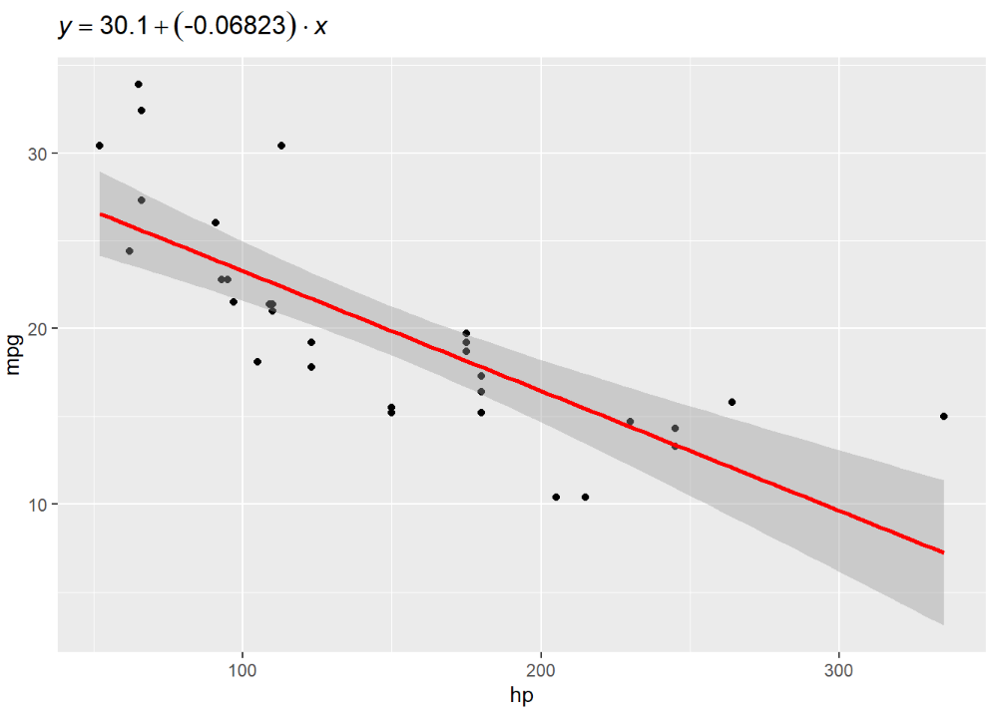

```{r setup, include=FALSE}
knitr::opts_chunk$set(echo = TRUE)
```

## 1 ggplot2 continue

## 1.1 ggplot2 part1-solution
Create the following ggplots based on the dataset ```iris```. This dataset gives measurements in centimeters of the variables sepal length and width with petal length and width for 50 flowers from each of 3 species of iris. The species are called Iris setosa, versicolor and virginica.

```{r}
# Loading data
data(iris)
newdata <- iris
str(newdata)
```

```{r}
# Loading package
library(ggplot2)

# Creating a satterplot for two variables 'Sepal.Length' and 'Sepal.Width'
# Write your anwser here
ggplot(data = newdata, mapping = aes(x = Sepal.Length, y = Sepal.Width)) + geom_point()
```


```{r}
# Adding another variable 'Species' and indicate 'Species' using color 
# Write your anwser here
ggplot(data = newdata, mapping = aes(x = Sepal.Length, y = Sepal.Width, col = Species)) + geom_point()
```

```{r}
# Creating a satterplot for two variables 'Petal.Length' and 'Petal.Width'
# Write your answer here
ggplot(data = newdata, mapping = aes(x = Petal.Length, y = Petal.Width)) + geom_point()
```

```{r}
# Adding another variable 'Species' and indicate 'Species' using color 
# Write your answer here
ggplot(data = newdata, mapping = aes(x = Petal.Length, y = Petal.Width, shape = Species)) + geom_point() + theme(plot.background = element_rect(fill = "lightblue", colour = "black"))
```

## 1.2 ggplot2 - Aesthetic

### 1.2.1 ggplot2 - Working with Axes
In this chapter, we will focus about the “Iris” dataset which is commonly used by data scientists.

**Implementing axes in Iris dataset**

Creating the plot points of Iris to show the relationship between Sepal Length and Petal Length.

Let us understand the functionality of aes which mentions the mapping structure of “ggplot2”. Aesthetic mappings describe the variable structure which is needed for plotting and the data which should be managed in individual layer format. The output is given below −

```{r}
# Load ggplot
library(ggplot2)

# Read in dataset
data(iris)
p <- ggplot(iris, aes(Sepal.Length, Petal.Length, colour=Species)) + geom_point()
p
```


Plot the markers with mentioned co-ordinates of x and y axes as mentioned below. It includes adding text, repeating text, highlighting particular area and adding segment as follows −

```{r}
# add text
p + annotate("text", x = 6, y = 5, label = "text")
```

```{r}
# add repeat
p + annotate("text", x = 4:6, y = 5:7, label = "text")
```

```{r}
# highlight an area
p + annotate("rect", xmin = 5, xmax = 7, ymin = 4, ymax = 6, alpha = .5)
```

```{r}
# segment
p + annotate("segment", x = 5, xend = 7, y = 4, yend = 5, colour = "black")
```

### 1.2.2 ggplot2 - Working with Legends

Axes and legends are collectively called as guides. They allow us to read observations from the plot and map them back with respect to original values. 

Following steps will be implemented to understand the working of legends in ggplot2 −

```{r}
# Load ggplot
library(ggplot2)
# Read in dataset
data(iris)

p <- ggplot(iris, aes(Sepal.Length, Petal.Length, colour=Species)) + geom_point()
p
```

The legends are created on right most corners of the plot above.

We can remove the legend with the help of property ```legend.position```:
```{r}
# Remove Legend
p + theme(legend.position="none")
```

We can also hide the **title of legend** with property ```element_blank()```:
```{r}
# Hide the legend title
p + theme(legend.title=element_blank())
```

$\color{red}{\text{In-class exercise}}$

Use the legend position to set legend on top of the plot.
```{r}
# Write your answer here
p <- ggplot(iris, aes(Sepal.Length, Petal.Length, colour=Species)) + geom_point()
p + theme(legend.position = "top")
```

We can change the font style of title and labels in legend.

```{r}
# Change the legend title and text font styles
# legend title
p + theme(legend.title = element_text(colour = "blue", size = 10, face = "bold"))
```

$\color{red}{\text{In-class exercise}}$

Change the font style of **legend text** to red and italic.
```{r}
# Write your answer here
p <- ggplot(iris, aes(Sepal.Length, Petal.Length, colour=Species)) + geom_point()
p + theme(legend.text = element_text(colour = "red", face = "italic"))
```

It is also possible to change legend titles using the function ```guides()```:
```{r}
# Change Legend Title using guides() Function
p + guides(color=guide_legend(title="Iris species"))

```


### 1.2.3 ggplot2 - Working with main titles and axis labels


```{r}
# Default plot
p <- ggplot(iris, aes(Sepal.Length, Petal.Length, colour=Species)) + geom_point()
p
```

Modify main titles and axis labels:
```{r}
# Modify main titles
p + ggtitle("main title") +
  xlab("x axis") + ylab("y axis")
# Or
# Change plot titles using the function labs() 
p +labs(title="Change main title",
        x ="change x axis", y = "change y axis")
```

$\color{red}{\text{In-class exercise}}$

Given the default plot:
1. set the title to "Plot of Petal length and Sepal length", the name of x axis to "Sepal.length (cm)", the name of y axis to "Petal.length (cm)". 
2. Change the color of plot title to blue and the font family to Playfair. 
3. Change the appearance of axis text to dodgerblue and italic.
(Hint: similar way as in modifying legend style.)
```{r}
# Default plot
p <- ggplot(iris, aes(Sepal.Length, Petal.Length, colour=Species)) + geom_point()
# write your answer here
p + ggtitle("Petal.length (cm)") +
  xlab("Sepal.length (cm)") +
  ylab("Petal.length (cm)") +
  theme(
    plot.title = element_text(colour = "blue"), # change plot title (TODO: change font family)
    axis.title = element_text(colour = "dodgerblue", face = "italic"),
  )

```


### 1.2.4 ggplot2 - Scatter Plots & Jitter Plots

Scatter Plots are similar to line graphs which are usually used for plotting. The scatter plots show how much one variable is related to another. 

Creating Basic Scatter Plot:
```{r}
# Basic Scatter Plot
ggplot(iris, aes(Sepal.Length, Petal.Length)) + geom_point()
```

We can change the shape of points with a property called shape in geom_point() function.
```{r}
# Change the shape of points
ggplot(iris, aes(Sepal.Length, Petal.Length)) + geom_point(shape=1)
```

Again, add color to different species of Iris:

```{r}
ggplot(iris, aes(Sepal.Length, Petal.Length, color = Species)) + geom_point(shape=1)
```


$\color{red}{\text{In-class exercise}}$

Now we will focus on establishing relationship between the variables. Draw linear regression lines by calling function ```geom_smooth()```.

```{r}
# write your answer here

```

We can also add a regression line with no shaded confidence region. Hint: set ```se``` attribute to **FALSE** in geom_smooth function.

```{r}
# write your answer here

```

**Jitter plots** include special effects with which scattered plots can be depicted. Jitter is nothing but a random value that is assigned to dots to separate data. Here, we take the ```mpg``` dataset for example. We can use ```help(mpg)``` to get dataset description.

```{r}
ggplot(mpg, aes(cyl, hwy)) + geom_point() + geom_jitter(aes(colour = class))
# Try the following code and see the difference.
# ggplot(mpg, aes(cyl, hwy, color = class)) + geom_point()
```


## 1.3 ggplot2 - More than geom_point()

New dataset: We are using data from the National Morbidity and Mortality Air Pollution Study (NMMAPS). To make the plots manageable we are limiting the data to Chicago and 1997–2000.

```{r eval = FALSE}
# install required packages by yourself ...
# install.packages("curl")
chic <- readr::read_csv("https://raw.githubusercontent.com/z3tt/ggplot-courses/main/data/chicago-nmmaps-custom.csv")
```

To be able to visualize chic, we have to use ggplot2 libarary.

```{r eval = FALSE}
library(ggplot2)
g <- ggplot(chic, aes(x = date, y = temp))
g + geom_point()
```

Nice! But this data could be also visualized as a line plot.

```{r eval = FALSE}
g + geom_line()
```

One can also combine several geometric layers.

```{r eval = FALSE}
g + geom_line() + geom_point()
```

$\color{red}{\text{In-class exercise}}$

Then, let's **Change Properties of Geometries**

1. Draw points and set the color of points to "firebrick", shape to "diamond" and size to 2.

```{r eval = FALSE}
# write your answer here

```

Each geom comes with its own properties (called arguments) and the same argument may result in a different change depending on the geom you are using. 

2. Draw points and lines. Set the color of lines to "firebrick", linetype to "dotted" and line width (lwd) to 0.3.

```{r eval = FALSE}
# write your answer here


```


## $\color{red}{\text{2 Advanced exercise}}$

Add "mathematical formula" as title to the plot you've got in **Lab4 1.2.5**. The result should be like this:

```{r echo=FALSE, out.width = "60%", fig.align = "left"}

```


```{r}
# Statistics layer
library(ggplot2)
p <- ggplot(data = mtcars, 
       mapping = aes(x = hp, y = mpg)) +
  geom_point() + 
  stat_smooth(method = lm, formula = y~x, col = "red", cex = 1)

# write your answers here

```