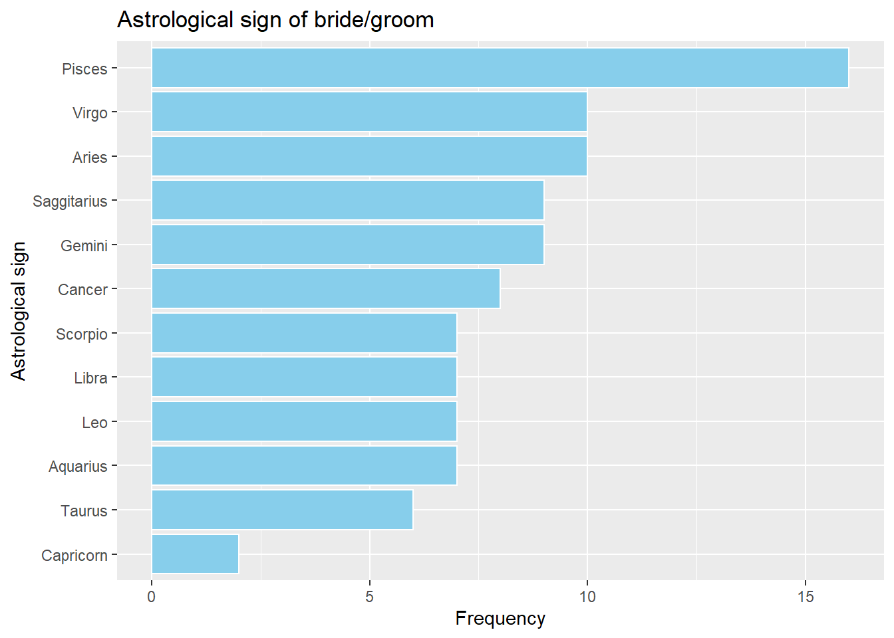

```{r setup, include=FALSE}
knitr::opts_chunk$set(echo = TRUE)
```

**Setup** 

Please installed the following packages if you haven’t installed them.

If you have installed the packages, set ```eval=False``` to skip the execution.
```{r eval=FALSE}
pkgs <- c("ggplot2", "dplyr", "mosaicData")
# install.packages(pkgs)
install.packages(pkgs, repos = "http://cran.us.r-project.org")
```


Univariate graphs plot the distribution of data from a single variable. The variable can be categorical (e.g., race, sex) or quantitative (e.g., age, weight, income).

## 1 Categorical

The distribution of a single categorical variable is typically plotted with a bar chart, a pie chart, or (less commonly) a tree map.

### 1.1 Bar chart

The ```Marriage``` dataset contains the marriage records of 98 individuals in Mobile County, Alabama. Below, a bar chart is used to display the distribution of wedding participants by race.

```{r}
library(ggplot2)
data(Marriage, package = "mosaicData")

# plot the distribution of race
ggplot(Marriage, aes(x = race)) +
  geom_bar()
```

The majority of participants are white, followed by black, with very few Hispanics or American Indians.

You can modify the bar fill and border colors, plot labels, and title by adding options to the ```geom_bar``` function.

```{r}
# plot the distribution of race with modified colors and labels
ggplot(Marriage, aes(x = race)) +
  geom_bar(
    fill = "cornflowerblue",
    color = "black"
  ) +
  labs(
    x = "Race",
    y = "Frequency",
    title = "Participants by race"
  )
```

### 1.1.1 Percents

Bars can represent percents rather than counts. For bar charts, the code ```aes(x=race)``` is actually a shortcut for ```aes(x = race, y = ..count..)```, where ```..count..``` is a special variable representing the frequency within each category. You can use this to calculate percentages, by specifying the ```y``` variable explicitly.

```{r}
# plot the distribution as percentages
ggplot(
  Marriage,
  aes(
    x = race,
    y = ..count.. / sum(..count..)
  )
) +
  geom_bar() +
  labs(
    x = "Race",
    y = "Percent",
    title = "Participants by race"
  ) +
  scale_y_continuous(labels = scales::percent)
```

In the code above, the ```scales``` package is used to add % symbols to the y-axis labels.


### 1.1.2 Sorting categories

It is often helpful to sort the bars by frequency. In the code below, the frequencies are calculated explicitly. Then the ```reorder``` function is used to sort the categories by the frequency. The option ```stat="identity"``` tells the plotting function not to calculate counts, because they are supplied directly.

```{r}
# calculate number of participants in
# each race category
library(dplyr)
plotdata <- Marriage %>%
  count(race)
print(plotdata)
```

This new dataset is then used to create the graph.

```{r}
# plot the bars in ascending order
ggplot(
  plotdata,
  aes(
    x = reorder(race, n),
    y = n
  )
) +
  geom_bar(stat = "identity") +
  labs(
    x = "Race",
    y = "Frequency",
    title = "Participants by race"
  )
```

The graph bars are sorted in ascending order. The ```identity``` statistic leaves the data unchanged.

$\color{red}{\text{In-class exercise}}$

Sort the bars in descending order. Hint: the values of -n of objects gives their reverse order.

```{r}
# write your answer here
ggplot(
  plotdata,
  aes(
    x = reorder(race, n, decreasing = TRUE),
    y = n
  )
) +
  geom_bar(stat = "identity") +
  labs(
    x = "Race",
    y = "Frequency",
    title = "Participants by race"
  )
```


### 1.1.3 Labeling bars

Finally, you may want to label each bar with its numerical value.

```{r}
# plot the bars with numeric labels
ggplot(
  plotdata,
  aes(
    x = race,
    y = n
  )
) +
  geom_bar(stat = "identity") +
  geom_text(aes(label = n),
    vjust = -0.5
  ) +
  labs(
    x = "Race",
    y = "Frequency",
    title = "Participants by race"
  )
```

Here ```geom_text``` adds the labels, and ```vjust``` controls vertical justification.


$\color{red}{\text{In-class exercise}}$

Putting these ideas together, you can create a graph like the one below. The color of bars is ```indianred3```.

```{r}
# Loading package
library(dplyr)
library(scales)

# Important!
plotdata <- Marriage %>%
  count(race) %>%
  mutate(
    pct = n / sum(n),
    pctlabel = paste0(round(pct * 100), "%")
  )

# try it: t1 = paste("a","b","c",sep = "+")

# plot the bars as percentages,
# in descending order with bar labels
# write your answer here
ggplot(
  plotdata,
  aes(
    x = reorder(race, n, decreasing = TRUE),
    y = pct
  )
) +
  geom_bar(stat = "identity", fill = "indianred3") +
  geom_text(aes(label = pctlabel),
    vjust = -0.5
  ) +
  labs(
    x = "Race",
    y = "Frequency",
    title = "Participants by race"
  ) +
  scale_y_continuous(labels = scales::percent)
```


### 1.1.4 Overlapping labels

Category labels may overlap if (1) there are many categories or (2) the labels are long. Consider the distribution of marriage officials.

```{r}
# basic bar chart with overlapping labels
ggplot(Marriage, aes(x = officialTitle)) +
  geom_bar() +
  labs(
    x = "Officiate",
    y = "Frequency",
    title = "Marriages by officiate"
  )
```

In this case, you can flip the x and y axes with the ```coord_flip``` function.

```{r}
# horizontal bar chart
ggplot(Marriage, aes(x = officialTitle)) +
  geom_bar() +
  labs(
    x = "",
    y = "Frequency",
    title = "Marriages by officiate"
  ) +
  coord_flip()
```


$\color{red}{\text{In-class exercise}}$

Second solution: you can rotate the axis labels.

Hint: set ```theme``` of the plot by changing the ```angle``` of ```axis.text.x``` to 45.

```{r}
# bar chart with rotated labels
# write your answer here
ggplot(Marriage, aes(x = officialTitle)) +
  geom_bar() +
  labs(
    x = "Officiate",
    y = "Frequency",
    title = "Marriages by officiate"
  ) +
  theme(axis.text.x = element_text(angle = 45, hjust = 1))
```


Third solution: you can try staggering the labels. The trick is to add a newline ```\n``` to every other label.

```{r}
# bar chart with staggered labels
lbls <- paste0(c("", "\n"), levels(Marriage$officialTitle))
ggplot(
  Marriage,
  aes(x = factor(officialTitle,
    labels = lbls
  ))
) +
  geom_bar() +
  labs(
    x = "",
    y = "Frequency",
    title = "Marriages by officiate"
  )
```


## 1.2 Pie chart

Pie charts are controversial in statistics. If your goal is to compare the frequency of categories, you are better off with bar charts (humans are better at judging the length of bars than the volume of pie slices). If your goal is compare each category with the the whole (e.g., what portion of participants are Hispanic compared to all participants), and the number of categories is small, then pie charts may work for you. It takes a bit more code to make an attractive pie chart in R.


```{r}
# create a basic ggplot2 pie chart
plotdata <- Marriage %>%
  count(race) %>%
  arrange(race) %>%
  mutate(prop = round(n * 100 / sum(n), 1))

ggplot(
  plotdata,
  aes(
    x = "",
    y = prop,
    fill = race
  )
) +
  geom_bar(
    width = 1,
    stat = "identity",
    color = "black"
  ) +
  coord_polar("y",
    start = 0,
    direction = -1
  ) +
  theme_void()
```

which are a stacked bar chart in polar coordinates. ```theme_void()``` presents a completely empty theme.

Now let’s get fancy and add labels.


```{r}
plotdata <- Marriage %>%
  count(race) %>%
  arrange(race) %>%
  mutate(prop = round(n * 100 / sum(n), 1))
+
  plotdata$label <- paste0(
  plotdata$race, "\n",
  round(plotdata$prop), "%"
)

ggplot(
  plotdata,
  aes(
    x = "",
    y = prop,
    fill = race
  )
) +
  geom_bar(
    width = 1,
    stat = "identity",
    color = "black"
  ) +
  geom_text(aes(label = label),
    position = position_stack(vjust = 0.5)
  ) +
  coord_polar("y",
    start = 0,
    direction = -1
  ) +
  theme_void()
```


$\color{red}{\text{In-class exercise}}$

Let's change bar color. 

You are asked to remove legend and add title "Participants by race" to the plot.


```{r}
# create a pie chart with slice labels
plotdata <- Marriage %>%
  count(race) %>%
  arrange(race) %>%
  mutate(prop = round(n * 100 / sum(n), 1))

plotdata$label <- paste0(
  plotdata$race, "\n",
  round(plotdata$prop), "%"
)

p <- ggplot(
  plotdata,
  aes(
    x = "",
    y = prop,
    fill = race
  )
) +
  geom_bar(
    width = 1,
    stat = "identity",
    color = "black"
  ) +
  scale_fill_manual(values = c(
    "#F03B20",
    "#F1A340",
    "#998EC3",
    "#7FCDBB"
  )) +
  geom_text(aes(label = label),
    position = position_stack(vjust = 0.5)
  ) +
  coord_polar(
    theta = "y",
    start = 0,
    direction = -1
  ) +
  theme_void()
# add code to the above function
p + theme(legend.position = "none") + labs(title = "Participants by race")
```


The pie chart makes it easy to compare each slice with the whole. For example, Back is seen to roughly a quarter of the total participants.


An alternative to plot pie chart is to use the ```pie``` function in library ```graphics```.

```{r}
# create a pie chart with slice labels
plotdata <- Marriage %>%
  count(race) %>%
  arrange(race) %>%
  mutate(prop = round(n * 100 / sum(n), 1))

plotdata$label <- paste0(
  plotdata$race, " ",
  round(plotdata$prop), "%"
)

pie(plotdata$prop,
  labels = plotdata$label,
  clockwise = TRUE,
  main = "Participants by race",
  col = c("#F03B20", "#F1A340", "#998EC3", "#7FCDBB")
)
```


### $\color{red}{\text{1.3 exercise}}$


Please write your code to plot a bar chart for variable `sign` of `Marriage` dataset, as shown follows.

1. x is "Astrological sign", y is "Frequency" and title is "Astrological sign of bride/groom".

2. Bar color is `skyblue`. 

3. Flip the x and y axes.

4. Plot the bar chart in descending order.

```{r figure2, echo=FALSE, out.width = '70%'}

```

```{r}
# Loading package
library(ggplot2)
library(dplyr)
# Loading data
data(Marriage, package = "mosaicData")
# count for sign (one column in Marriage dataset)
# write your answer here

plotdata <- Marriage %>%
  count(sign)

plotdata
ggplot(
  plotdata,
  aes(
    x = reorder(sign, n),
    y = n
  )
) +
  geom_bar(stat = "identity", fill = "skyblue", color = "white") +
  labs(
    x = "Astrological sign",
    y = "Frequency",
    title = "Astrological sign of bride/groom"
  ) +
  coord_flip()
```


## 2 Quantitative

In the `Marriage` dataset, age is quantitative variable. The distribution of a single quantitative variable is typically plotted with a histogram, kernel density plot, or dot plot.

### 2.1 Histogram

Histograms are the most common approach to visualizing a quantitative variable. In a histogram, the values of a variable are typically divided up into adjacent, equal width ranges (called bins), and the number of observations in each bin is plotted with a vertical bar.

```{r}
library(ggplot2)

# plot the age distribution using a histogram
ggplot(Marriage, aes(x = age)) +
  geom_histogram() +
  labs(
    title = "Participants by age",
    x = "Age"
  )
```

Histogram colors can be modified using two options

`fill` - fill color for the bars
`color` - border color around the bars

```{r}
# plot the histogram with blue bars and white borders
ggplot(Marriage, aes(x = age)) +
  geom_histogram(
    fill = "cornflowerblue",
    color = "white"
  ) +
  labs(
    title = "Participants by age",
    x = "Age"
  )
```


One of the most important histogram options is `bins`, which controls the number of bins into which the numeric variable is divided (i.e., the number of bars in the plot). The default is 30.

Alternatively, you can specify the `binwidth`, the width of the bins represented by the bars.

$\color{red}{\text{In-class exercise}}$

Set the number of bins to 20, and compare with original plot. 

```{r}
# plot the histogram with 20 bins
# write your answer here
ggplot(Marriage, aes(x = age)) +
  geom_histogram(
    bins = 20,
    fill = "cornflowerblue",
    color = "white"
  ) +
  labs(
    title = "Participants by age",
    x = "Age"
  )
```

Alternatively, you can specify the binwidth, the width of the bins represented by the bars.

```{r}
# plot the histogram with a binwidth of 5
ggplot(Marriage, aes(x = age)) +
  geom_histogram(
    fill = "cornflowerblue",
    color = "white",
    binwidth = 5
  ) +
  labs(
    title = "Participants by age",
    subtitle = "binwidth = 5 years",
    x = "Age"
  )
```


As with bar charts, the y-axis can represent counts or percent of the total.

```{r}
# plot the histogram with percentages on the y-axis
library(scales)
ggplot(
  Marriage,
  aes(x = age, y = after_stat(count / sum(count)))
) +
  geom_histogram(
    fill = "cornflowerblue",
    color = "white",
    binwidth = 5
  ) +
  labs(
    title = "Participants by age",
    y = "Percent",
    x = "Age"
  ) +
  scale_y_continuous(labels = percent)
```

### 2.2 Kernel density plot

An alternative to a histogram is the kernel density plot. Technically, kernel density estimation is a nonparametric method for estimating the probability density function of a continuous random variable. Basically, we are trying to draw a smoothed histogram, where the area under the curve equals one.


```{r}
# Create a kernel density plot of age
ggplot(Marriage, aes(x = age)) +
  geom_density() +
  labs(title = "Participants by age")
```


As with previous charts, we can use `fill` and `color` to specify the fill and border colors.

```{r}
# Create a kernel density plot of age
ggplot(Marriage, aes(x = age)) +
  geom_density(fill = "indianred3") +
  labs(title = "Participants by age")
```


The degree of smoothness is controlled by the bandwidth parameter `bw`. To find the default value for a particular variable, use the `bw.nrd0` function. Values that are larger will result in more smoothing, while values that are smaller will produce less smoothing.

```{r}
# default bandwidth for the age variable
bw.nrd0(Marriage$age)
```

$\color{red}{\text{In-class exercise}}$

Set bandwidth `bw` of age to 1, and fill the density plot to "deepskyblue".

Hint: the setting involves `fill` and `bw` attributes in `geom_density()`.

```{r}
# Create a kernel density plot of age
# write your answer here
ggplot(Marriage, aes(x = age)) +
  geom_density(fill = "deepskyblue", bw = 1) +
  labs(title = "Participants by age")
```


### 2.3 Dot chart

In dot chart, each observation is represented by a dot. By default, the width of a dot corresponds to the bin width, and dots are stacked, with each dot representing one observation. This works best when the number of observations is small (say, less than 150).

```{r}
# plot the age distribution using a dotplot
ggplot(Marriage, aes(x = age)) +
  geom_dotplot() +
  labs(
    title = "Participants by age",
    y = "Proportion",
    x = "Age"
  )
```

The `fill` and `color` options can be used to specify the fill and border color of each dot respectively.

$\color{red}{\text{In-class exercise}}$

Draw gold dots with black borders.

Hint: the setting involves `fill` and `color` attributes.
 
```{r}
# write your answer here
ggplot(Marriage, aes(x = age)) +
  geom_dotplot(color = "black", fill = "gold") +
  labs(
    title = "Participants by age",
    y = "Proportion",
    x = "Age"
  )
```
