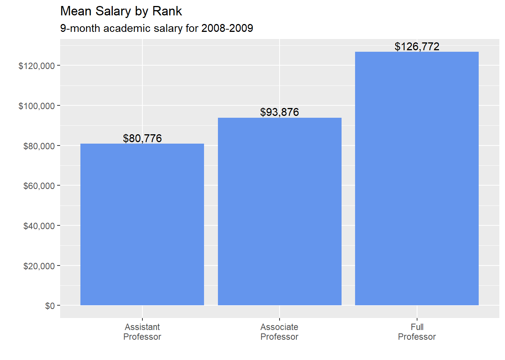
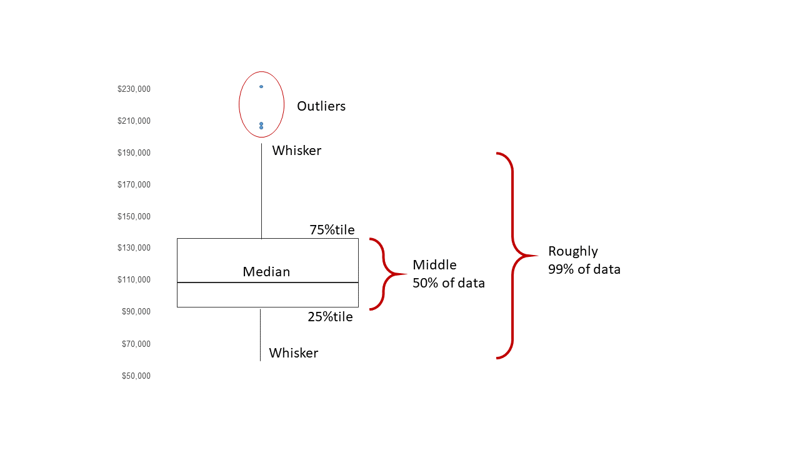
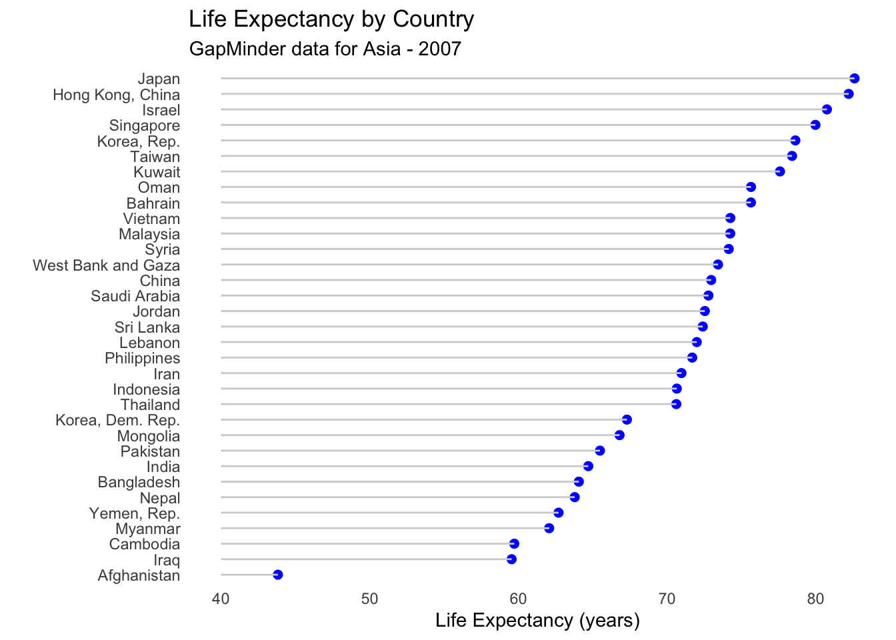

```{r setup, include=FALSE}
knitr::opts_chunk$set(echo = TRUE)
```
Bivariate graphs display the relationship between two variables. The type of graph will depend on the measurement level of the variables (categorical or quantitative).

**Setup**

```{r eval=FALSE}
# If you have not installed the following packages, please copy the following codes to console to install the required packages
pkgs <- c("gapminder", "mosaicData", "carData")
#install.packages(pkgs)
install.packages(pkgs, repos = "http://cran.us.r-project.org")
```


# 1 Categorical vs. Categorical

The distribution of a single categorical variable is typically plotted with a bar chart, a pie chart, or (less commonly) a tree map.

### 1.1 Stacked bar chart

Let’s plot the relationship between `automobile` class and drive type (front-wheel, rear-wheel, or 4-wheel drive) for the automobiles in the Fuel economy dataset.

```{r}
library(ggplot2)

# stacked bar chart
ggplot(mpg, 
       aes(x = class, 
           fill = drv)) + 
  geom_bar(position = "stack")
```

From the chart, we can see for example, that the most common vehicle is the SUV. All 2seater cars are rear wheel drive, while most, but not all SUVs are 4-wheel drive.

Stacked is the default, so the last line could have also been written as `geom_bar()`.

### 1.2 Grouped bar chart

Grouped bar charts place bars for the second categorical variable side-by-side. To create a grouped bar plot use the `position = "dodge"` option.

```{r}
library(ggplot2)

# grouped bar plot
ggplot(mpg, 
       aes(x = class, 
           fill = drv)) + 
  geom_bar(position = "dodge")
```

Notice that all Minivans are front-wheel drive. By default, zero count bars are dropped and the remaining bars are made wider. This may not be the behavior you want. You can modify this using the `position = position_dodge(preserve = "single")"` option.

$\color{red}{\text{In-class exercise}}$

```{r}
library(ggplot2)

# grouped bar plot preserving zero count bars
# write your answer here
ggplot(mpg, 
       aes(x = class, 
           fill = drv)) + 
  geom_bar(position = position_dodge2(preserve = "single"))

```

Note that this option is only available in the latest development version of `ggplot2`, but should should be generally available shortly.


### 1.3 Segmented bar chart

A segmented bar plot is a stacked bar plot where each bar represents 100 percent. You can create a segmented bar chart using the `position = "fill"` option.

```{r}
library(ggplot2)

# bar plot, with each bar representing 100%
ggplot(mpg, 
       aes(x = class, 
           fill = drv)) + 
  geom_bar(position = "fill") +
  labs(y = "Proportion")
```

This type of plot is particularly useful if the goal is to compare the percentage of a category in one variable across each level of another variable. For example, the proportion of front-wheel drive cars go up as you move from compact, to midsize, to minivan.

## Improving the color and labeling

You can use additional options to improve color and labeling. In the graph below.

- `factor` modifies the order of the categories for the class variable and both the order and the labels for the drive variable

- `scale_y_continuous` modifies the y-axis tick mark labels

- `labs` provides a title and changed the labels for the x and y axes and the legend

- `scale_fill_brewer` changes the fill color scheme

- `theme_minimal` removes the grey background and changed the grid color

```{r}
library(ggplot2)

# bar plot, with each bar representing 100%, 
# reordered bars, and better labels and colors
library(scales)
ggplot(mpg, 
       aes(x = factor(class,
                      levels = c("2seater", "subcompact", 
                                "compact", "midsize", 
                                "minivan", "suv", "pickup")),
           fill = factor(drv, 
                         levels = c("f", "r", "4"),
                         labels = c("front-wheel", 
                                    "rear-wheel", 
                                    "4-wheel")))) + 
  geom_bar(position = "fill") +
  scale_y_continuous(breaks = seq(0, 1, .2), 
                     label = percent) +
  scale_fill_brewer(palette = "Set2") +
  labs(y = "Percent", 
       fill = "Drive Train",
       x = "Class",
       title = "Automobile Drive by Class") +
  theme_minimal()
```

In the graph above, the `factor` function was used to reorder and/or rename the levels of a categorical variable. You could also apply this to the original dataset, making these changes permanent. It would then apply to all future graphs using that dataset. For example:

```{r}
# change the order the levels for the categorical variable "class"
mpg$class = factor(mpg$class,
                   levels = c("2seater", "subcompact", 
                              "compact", "midsize", 
                              "minivan", "suv", "pickup"))
```

The `factor` function is placed within the ggplot function to demonstrate that, if desired, you can change the order of the categories and labels for the categories for a single graph.

The other functions are discussed more fully in the section on Customizing graphs.

Next, let’s add percent labels to each segment. First, we’ll create a summary dataset that has the necessary labels.

```{r}
# create a summary dataset
library(dplyr)
plotdata <- mpg %>%
  group_by(class, drv) %>%
  summarize(n = n()) %>% 
  mutate(pct = n/sum(n),
         lbl = scales::percent(pct))
plotdata
```

Next, we’ll use this dataset and the `geom_text` function to add labels to each bar segment.

```{r}
# create segmented bar chart
# adding labels to each segment

ggplot(plotdata, 
       aes(x = factor(class,
                      levels = c("2seater", "subcompact", 
                                 "compact", "midsize", 
                                 "minivan", "suv", "pickup")),
           y = pct,
           fill = factor(drv, 
                         levels = c("f", "r", "4"),
                         labels = c("front-wheel", 
                                    "rear-wheel", 
                                    "4-wheel")))) + 
  geom_bar(stat = "identity",
           position = "fill") +
  scale_y_continuous(breaks = seq(0, 1, .2), 
                     labels = percent) +
  geom_text(aes(label = lbl), 
            size = 3, 
            position = position_stack(vjust = 0.5)) +
  scale_fill_brewer(palette = "Set2") +
  labs(y = "Percent", 
       fill = "Drive Train",
       x = "Class",
       title = "Automobile Drive by Class") +
  theme_minimal()
```

Now we have a graph that is easy to read and interpret.

## 2 Quantitative vs. Quantitative

The relationship between two quantitative variables is typically displayed using scatterplots and line graphs.

### 2.1 Scatterplot

The simplest display of two quantitative variables is a scatterplot, with each variable represented on an axis. For example, using the Salaries dataset, we can plot experience (yrs.since.phd) vs. academic salary (salary) for college professors.

```{r}
library(ggplot2)
data(Salaries, package="carData")

# simple scatterplot
ggplot(Salaries, 
       aes(x = yrs.since.phd, 
           y = salary)) +
  geom_point()
```

`geom_point` options can be used to change the
* `color` - point color
* `size` - point size
* `shape` - point shape
* `alpha` - point transparency. Transparency ranges from 0 (transparent) to 1 (opaque), and is a useful parameter when points overlap.

The functions `scale_x_continuous` and `scale_y_continuous` control the scaling on x and y axes respectively.

See Customizing graphs (we will introduce in the comming weeks) for details.

We can use these options and functions to create a more attractive scatterplot.

```{r}
# Scatterplot with color, transparency, and axis scaling
# enhanced scatter plot
ggplot(Salaries, 
       aes(x = yrs.since.phd, 
           y = salary)) +
  geom_point(color="cornflowerblue", 
             size = 2, 
             alpha=.8) +
  scale_y_continuous(label = scales::dollar, 
                     limits = c(50000, 250000)) +
  scale_x_continuous(breaks = seq(0, 60, 10), 
                     limits=c(0, 60)) + 
  labs(x = "Years Since PhD",
       y = "",
       title = "Experience vs. Salary",
       subtitle = "9-month salary for 2008-2009")
```

### Line plot
When one of the two variables represents time, a line plot can be an effective method of displaying relationship. For example, the code below displays the relationship between time (year) and life expectancy (lifeExp) in the United States between 1952 and 2007. The data comes from the `gapminder` dataset.


```{r}
data(gapminder, package="gapminder")

# Select US cases
library(dplyr)
plotdata <- filter(gapminder, 
                   country == "United States")

# simple line plot
ggplot(plotdata, 
       aes(x = year, 
           y = lifeExp)) +
  geom_line() 
```


$\color{red}{\text{In-class exercise}}$

It is hard to read individual values in the graph above. In the next plot, we’ll add points as well.

1. Add `geom_point()` with `size=3` and `color="steelblue"`.

2. Set `x = "Year"`, `y = "Life Expectancy (years)"`, `title = "Life expectancy changes over time"`, `subtitle = "United States (1952-2007)"`, `caption = "Source: http://www.gapminder.org/data/"`.

```{r}
# line plot with points
# and improved labeling
# write your answer here
ggplot(plotdata, 
       aes(x = year, 
           y = lifeExp)) +
  geom_line() +
  geom_point(size=3, color="steelblue") +
  labs(x = "Year", y = "Life Expectancy (years)", title = "Life expectancy changes over time", subtitle = "United States (1952-2007)", caption = "Source: http://www.gapminder.org/data/")

```

Time dependent data is covered in more detail under Time series. Customizing line graphs is covered in the Customizing graphs section.

## 3 Categorical vs. Quantitative

When plotting the relationship between a categorical variable and a quantitative variable, a large number of graph types are available. These include bar charts using summary statistics, grouped kernel density plots, and Cleveland plots.

### 3.1 Bar chart (on summary statistics)

In previous sections, bar charts were used to display the number of cases by category for a single variable or for two variables. You can also use bar charts to display other summary statistics (e.g., means or medians) on a quantitative variable for each level of a categorical variable.

For example, the following graph displays the mean salary for a sample of university professors by their academic rank.

```{r}
data(Salaries, package="carData")

# calculate mean salary for each rank
library(dplyr)
plotdata <- Salaries %>%
  group_by(rank) %>%
  summarize(mean_salary = mean(salary))

# plot mean salaries
ggplot(plotdata, 
       aes(x = rank, 
           y = mean_salary)) +
  geom_bar(stat = "identity")
```


$\color{red}{\text{In-class exercise}}$

We can make it more attractive like following.

```{r figure0, echo=FALSE, out.width = '70%'}

```

```{r}
# plot mean salaries in a more attractive fashion
# write your answer here
ggplot(plotdata, 
       aes(x = factor(rank, 
                         levels = c("AsstProf", "AssocProf", "Prof"),
                         labels = c("Assistant Professor", 
                                    "Associate Professor", 
                                    "Full Professor")), 
           y = mean_salary)) +
  geom_bar(stat = "identity", fill="cornflowerblue") +
  geom_text(aes(label = paste0("$", comma(mean_salary, accuracy = 1, scale = 1))), vjust = -0.5, color = "black", size = 4) +
  scale_y_continuous(label = scales::dollar, 
                     limits = c(0, 130000),
                     breaks = seq(0, 130000, 20000)) +
  labs(x = "",
       y = "",
       title = "Mean Salary by Rank",
       subtitle = "9-month academic salary for 2008-2009")

```

One limitation of such plots is that they do not display the distribution of the data - only the summary statistic for each group. The plots below correct this limitation to some extent.


### 3.2 Grouped kernel density plots

Draw kernel density plot of Salaries taking `example 2.2 in lab6` as reference, where salary is x axes.

$\color{red}{\text{In-class exercise}}$

```{r}
data(Salaries, package="carData")

# draw kernel density plot
# write your answer here
ggplot(Salaries, aes(x = salary)) +
  geom_density()
```

One can compare groups on a numeric variable by superimposing *kernel density* plots in a single graph. 

$\color{red}{\text{In-class exercise}}$

Split the density according to the `rank` of professors. 

Hint: specify the `fill` property; set `alpha=0.4` and see the effect.

```{r}
data(Salaries, package="carData")

# draw kernel density plot
# write your answer here
ggplot(Salaries, aes(x = salary, fill = rank)) +
  geom_density(alpha = 0.4)

```


### 3.3 Box plots

A boxplot displays the 25-th percentile, median, and 75-th percentile of a distribution. The whiskers (vertical lines) capture roughly 99% of a normal distribution, and observations outside this range are plotted as points representing outliers (see the figure below).

image:

```{r figure1, echo=FALSE, out.width = '100%'}

```

Box plot Side-by-side box plots are very useful for comparing groups (i.e., the levels of a categorical variable) on a numerical variable.

```{r}
# plot the distribution of salaries by rank using boxplots
ggplot(Salaries, 
       aes(x = rank, 
           y = salary)) +
  geom_boxplot() +
  labs(title = "Salary distribution by rank")
```

Notched boxplots provide an approximate method for visualizing whether groups differ. Although not a formal test, if the notches of two boxplots do not overlap, there is strong evidence (95% confidence) that the medians of the two groups differ.

```{r}
# plot the distribution of salaries by rank using boxplots
ggplot(Salaries, aes(x = rank, 
                     y = salary)) +
  geom_boxplot(notch = TRUE, 
               fill = "cornflowerblue", 
               alpha = .7) +
  labs(title = "Salary distribution by rank")
```

In the example above, all three groups appear to differ.

One of the advantages of boxplots is that their widths are not usually meaningful. This allows you to compare the distribution of many groups in a single graph.


### 3.4 Cleveland Dot Charts

Cleveland plots are useful when you want to compare a numeric statistic for a large number of groups. For example, say that you want to compare the 2007 life expectancy for Asian country using the `gapminder` dataset.

```{r}
data(gapminder, package="gapminder")

# subset Asian countries in 2007
library(dplyr)
plotdata <- gapminder %>%
  filter(continent == "Asia" & 
         year == 2007)

# basic Cleveland plot of life expectancy by country
ggplot(plotdata, 
       aes(x= lifeExp, y = country)) +
  geom_point()
```

$\color{red}{\text{In-class exercise}}$

Comparisons are usually easier if the `y-axis` is sorted. Hint: use reorder() for y-axis.

```{r}
# write your answer here
# Sorted Cleveland plot
ggplot(plotdata, 
       aes(x= lifeExp, y = reorder(country, lifeExp))) +
  geom_point()

```

Next is the example of using `geom_segment()` to draw line segments.

```{r}
ggplot(plotdata, 
       aes(x = lifeExp, 
           y = country)) + 
geom_segment(aes(x = 40, 
               xend = lifeExp, 
               y = country,
               yend = country
               ),
               color = "lightblue")
```

Combine `reorder()` and `geom_segment()` to draw plot in the following:

```{r}
# Fancy Cleveland plot
# write your answer here
ggplot(plotdata,
       aes(x = lifeExp,
           y = reorder(country, lifeExp))) +
  geom_point(color = "blue",
             size = 2) +
  geom_segment(aes(
    x = 40,
    xend = lifeExp,
    y = country,
    yend = country
  ),
  color = "grey",) +
  labs(title = "Life Expectancy by Country",
       subtitle = "GapMinder data for Asia - 2007",
       x = "Life Expectancy (years)") +
  theme_light() +
  theme(
    panel.grid.major = element_blank(),
    panel.grid.minor = element_blank(),
    panel.border = element_blank(),
    panel.background = element_blank(),
    axis.ticks.y = element_blank()
  )
```


```{r figure2, echo=FALSE, out.width = '80%'}

```


